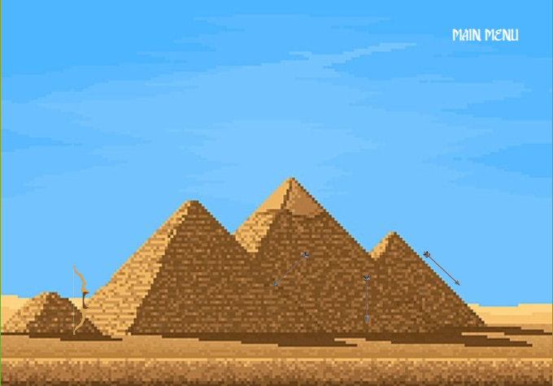

# **Introito Antiapotropaico,** 
## *o cómo contactar con los dioses para propósitos malignos por mandato de la faraona suprema*

Esto es un proyecto para la asignatura de Programación de Videojuegos en Lenguaje Intrepretados del Grado de Videojuegos de la Universidad Complutense de Madrid.

### Redes Sociales

Twitter (X): @Sopa de Escalofríos [https://x.com/SopaEscalofrios]

Email: sopadeescalofrios@gmail.com

### Descripción
En Introito Antiapotropaico, o cómo contactar con los dioses para propósitos malignos por mandato de la faraona suprema, el jugador encarna a un escriba esclavo de una faraona en el Antiguo Egipto. 
El jugador contactará con distintos dioses a través de rituales, para enviar unas cartas y poder complacer a su superiora y desbloquear distintos finales.

Podrá jugar a diferentes minijuegos para poder ser más afín a según qué dios, y así, conseguir el objetivo de la faraona: Convertirse en una diosa más.

### Web del juego
nievesag.github.io/SopaDeEscalofrios/

### Imágenes del juego

# Introito Antiapotropaico GDD 

**Introito Antiapotropaico, o cómo contactar con los dioses para propósitos malignos por mandato de la faraona suprema**

Autores: Carmen Gómez Becerra, Daniel Moreno Álvarez, Daniel Zhu, Denisa Juarranz Berindea, Nieves Alonso Gilsanz  
Grupo 6 - Sopa de escalofríos

---

### 1. Ficha técnica

**Título:** Introito Antiapotropaico, o cómo contactar con los dioses para propósitos malignos por mandato de la faraona suprema  
**Rating:** +13  
**Género:** Minijuegos  
**Plataforma:** Navegador web  
**Target:** Aficionados a los minijuegos tipo juegos flash y a la cultura egipcia  
**Modos de juego:** Un jugador  

### 2. Descripción

En Introito Antiapotropaico, o cómo contactar con los dioses para propósitos malignos por mandato de la faraona suprema, el jugador encarna a un escriba esclavo de una faraona en el Antiguo Egipto. El jugador contactará con distintos dioses a través de rituales para complacer a su superiora y desbloquear distintos finales.

### 3. Cartas usadas

| Persona           | Carta            | Detalles                                      |
|-------------------|------------------|-----------------------------------------------|
| Carmen Gómez      | Código: p12      | Nombre: Miedo - Tipo: Personaje / Emoción     |
| Daniel Moreno     | Código: m28      | Nombre: 7 Wonders - Tipo: Mecánica            |
| Daniel Zhu        | Código: p14      | Nombre: Ratón Comecables - Tipo: Personaje    |
| Denisa Juarranz   | Código: a12      | Nombre: Egipto - Tipo: Ambientación           |
| Nieves Alonso     | Código: m35      | Nombre: The Legend of Zelda: Majora’s Mask    |

## 4. Ciclo de juego

### 4.1. Partida genérica
El juego se basa en 5 ciclos, representados en días, en los que el jugador puede escribir hasta 3 cartas como máximo, una carta se puede escribir jugando uno de los 5 minijuegos a disposición del jugador. Cada día se tendrán los mismos 5 minijuegos disponibles y el jugador tendrá la libertad de jugar los que quiera, incluso de repetirlos o de no jugar ninguno. Una vez pasados los cinco ciclos, se revelará el final desbloqueado.

- **S0)** Escenario inicial: Cada vez que se vuelva a él, se revelará parte de la historia (ya sea mediante diálogos o cualquier tipo de momento narrativo).
- **S1)** Selección de minijuegos: El jugador elige los minijuegos que desea jugar. Visualmente será la misma sala que el escenario inicial, pero el jugador tiene libertad de moverse y acceder a los minijuegos distribuidos en las diferentes salas. Al pasar de día, se vuelve a S0, y el jugador elige cuándo terminar el día, incluso sin haber escrito las 3 cartas. Siempre tiene a disposición un botón de “pasar de día” para avanzar al siguiente ciclo.
- **S2)** Jugar un minijuego: Hay 5 disponibles, cada uno representa a un dios y será la forma de contactarlos mediante cartas. Se pueden jugar hasta 3 minijuegos por día como máximo. También existe la opción de volver al estado S0, pasando de ciclo sin haber jugado el máximo de 3 minijuegos.
- **S3)** Al completar 5 días (ciclos), se desbloquea un final de los 6 disponibles.

---

## 5. Minijuegos
Los minijuegos progresan en dificultad según se avance en el transcurso de los días. Las etapas de dificultad son:
- **Fácil** (días 1 y 2)
- **Normal** (días 3 y 4)
- **Difícil** (día 5)

Cada día, el jugador puede realizar hasta tres minijuegos, ya que el escriba solo puede escribir tres cartas de recomendación al día antes de cansarse. El jugador también puede optar por no escribir ninguna carta o solo algunas, afectando así el resultado final del juego.

### 5.1. Minijuego 1: «Camino a la Duat»
La idea es llevar un corazón humano de un punto a otro en un recorrido con obstáculos. El jugador debe empujarlos en un determinado orden para poder despejar un camino hacia la salida y poder arrastrar el corazón sin bloquearse a sí mismo.

#### 5.1.1. Contexto
> "Socar te ama. A ti y a cada uno de los futuros muertos. Te ama a ti, con tus órganos frescos, y me ama a mí, con mis órganos podridos. Esa piel fina que te recubre te contiene y tras la muerte Socar te contendrá como una piel transitoria en tu viaje por la Duat..."

#### 5.1.2. Mecánicas

- **Movimiento:** Podrás moverte por el mapa con las flechas (↑, ↓, →, ←) y con el WASD. El espacio de movimiento lo limitarán las cajas y paredes del puzle.
- **Empujar / Tirar:** El jugador podrá empujar y tirar cajas para abrirse paso y llevar los órganos. Se pueden agarrar objetos manteniendo presionada la tecla de espacio, empujándolos hacia adelante o tirando hacia atrás.
- **Tiempo:** El jugador tiene un límite de tiempo para resolver el puzle. Dependiendo de la dificultad del nivel, este límite cambiará.
- **Terrenos:**
  - **Terreno estándar:** Se comporta de manera normal.
  - **Hielo:** Los bloques empujados en este terreno se deslizarán hasta chocar o pasar a un terreno estándar.

#### 5.1.3. Coleccionables
- **Primer día:** «Amset», vasija con tapa en forma de cabeza humana que guarda el hígado.
- **Segundo día:** «Hapy», vasija con tapa en forma de cabeza de babuino que guarda los pulmones.
- **Tercer día:** «Kebeshenuef», vasija con tapa en forma de cabeza de halcón que guarda los intestinos.
- **Cuarto día:** «Duamutef», vasija con tapa en forma de chacal que guarda el estómago.
- **Quinto día:** «Henu», barca que posee Socar para cruzar la Duat.

#### 5.1.4. Dificultades
- **Fácil (primer y segundo día):** 60 segundos, órganos: hígado y pulmones, terreno: estándar.
- **Normal (tercer y cuarto día):** 45 segundos, órganos: hígado, pulmones e intestino, terreno: estándar y hielo.
- **Difícil (quinto día):** 30 segundos, órganos: hígado, pulmones, intestino y estómago, terreno: estándar y hielo.

---

### 5.2. Minijuego 2: «La Vasija Entresija»
La idea es lanzar un vaso canopo con una fuerza y una dirección angular a elección del jugador, teniendo como objetivo llegar lo más lejos posible e ir sumando puntuación por medio de chocar (o esquivar) obstáculos.

#### 5.2.1. Contexto
> "Nun, Las Aguas de la Vida, está encolerizado: una fuerte tempestad llena el paisaje. Una fuerte lluvia que se siente como pedradas, fortísimos relámpagos que son capaces de acobardar al más valeroso, vorágines que tragan todo a su paso..."

#### 5.2.2. Mecánicas

- **Lanzamiento:** El jugador puede lanzar el vaso canopo en una dirección y con una fuerza determinadas.
  - La dirección se establece según la posición a la que apunte el ratón.
  - La fuerza de disparo se mide manteniendo el clic, haciendo aparecer una barra que sube y baja. Se debe soltar en el momento justo para conseguir una mayor o menor fuerza.
- **Movimiento:** Se puede mover el vaso canopo un poco con las flechas de dirección (←, →) o con (A, D) para interactuar con los obstáculos.
- **Obstáculos que favorecen al jugador:**
  - **Cocodrilo:** Al contacto, el jugador rebota e impulsa al vaso a mayor velocidad, permitiendo llegar más lejos.
  - **Agua:** El agua hace rebotar al jugador hasta tres veces. Al tercer rebote, se hunde en el agua y deja de avanzar.
- **Obstáculos que entorpecen al jugador:**
  - **Vorágine:** Al contacto, termina la partida y la puntuación.
  - **Hipopótamo:** Disminuye la velocidad del vaso tras escupirlo.
- **Medidor de distancia:** En una esquina superior de la pantalla hay un medidor que muestra la distancia alcanzada.

#### 5.2.3. Coleccionables
- **Primer día:** «Pluma de la corona», una pluma de la corona de plumas de Anuket.
- **Segundo día:** «Concha cauri».
- **Tercer día:** «Frasco Asuán», frasco de alabastro lleno de agua de las cataratas de Asuán.
- **Cuarto día:** «Cetro de Papiro».
- **Quinto día:** «Cefalea bóvida», cabeza de una gacela dorcas, símbolo sagrado de Anuket.

#### 5.2.4. Dificultades
- **Fácil (primer y segundo día):** Obstáculos: agua, cocodrilo, tortuga de caparazón blando y garza.
- **Normal (tercer y cuarto día):** Obstáculos: añade el hipopótamo, más los anteriores.
- **Difícil (quinto día):** Obstáculos: añade la vorágine, más los anteriores.

---

### 5.3. Minijuego 3: «Al rescate de los escarabajos»
El objetivo es rescatar a unos escarabajos atrapados, acumulando puntos por cada escarabajo rescatado. Es un juego tipo "bubble shooter".

#### 4.3.1. Contexto
> "Jepri, el dios del sol autocreado, sufre de una fuerte tristeza: sus adorados ahijados, los escarabajos de todo Egipto, han sido capturados..."

#### 4.3.2. Dificultades
- **Fácil (Días 1 y 2):** Dos colores de recolectables (verde y rojo). Bajarán lentamente.
- **Intermedio (Días 3 y 4):** Tres colores de recolectables (verde, azul y rojo). Bajarán a velocidad moderada.
- **Difícil (Día 5):** Cuatro colores de recolectables (verde, azul, amarillo y rojo). Bajarán rápidamente.

#### 4.3.3. Mecánicas
- **Lanzamiento:** Apuntar y disparar con el ratón. La burbuja podrá rebotar en las paredes.
- **Escarabajos Especiales:**
  - **Escarabomba:** Elimina todos los escarabajos en un área de alrededor.
  - **Escolorobajo:** Elimina todos los escarabajos de su color en la pantalla.
  - **Combos:** Explota un Escarabomba y toca un Escolorobajo dentro de su área de destrucción para activar su efecto.
- **Caída:** Se deben agrupar al menos 3 escarabajos del mismo color para liberarlos.

#### 4.3.4. Coleccionables
- **Primer día:** Escarabajo negro.
- **Segundo día:** Escarabajo verde.
- **Tercer día:** Escarabajo azul.
- **Cuarto día:** Escarabajo rojo.
- **Quinto día:** Escarabajo dorado.

---

### 5.4. Minijuego 4: «Tiro al arco mágico»
Juego de tipo Angry Birds en el que el jugador debe cazar animales usando diferentes tipos de flechas mágicas.

#### 4.4.1. Contexto
> "Inheret, 'aquel que ha traído la diosa lejana y aquel que simboliza el poder creativo del sol', te ha encargado dar exterminio a aquellos animales indignos de vivir en su desierto..."

#### 4.4.2. Dificultades
- **Fácil (Días 1 y 2):** 9 flechas mágicas (3 de cada tipo) para todas las presas.
- **Intermedio (Días 3 y 4):** 5 flechas (3 mágicas y 2 normales).
- **Difícil (Día 5):** 5 flechas normales (se permite fallar solo una).

#### 4.4.3. Mecánicas
- **Lanzamiento:** Arrastrar y soltar con el ratón para cargar y disparar la flecha. Click en el aire para activar el efecto especial de cada flecha mágica.
- **Tipos de flechas:**
  - **Flecha triple:** Se multiplica en 3 flechas.
  - **Flecha expansiva:** Se hace más grande.
  - **Flecha explosiva:** Causa una explosión en área.

#### 4.4.4. Coleccionables
- **Primer día:** «Flecha», punta de flecha destrozada.
- **Segundo día:** «Lanza», punta de lanza destrozada.
- **Tercer día:** «Flecha mágica», punta de flecha mágica.
- **Cuarto día:** «Lanza mágica», punta de lanza mágica.
- **Quinto día:** «Pluma», pluma dorada.

---

### 5.5. Minijuego 5: «El sendero del Sol»
Juego de tipo puzle en el que el jugador debe guiar un rayo de sol a través de un tablero utilizando espejos.

#### 5.5.1. Contexto
> "Shu, divinidad danzante del aire, él desea iluminar todo a su paso, él es la sequedad, él es el tenue brillo de atardecer…"

#### 5.5.2. Dificultades
Cada día incluye un tablero diferente con más o menos espejos y obstáculos.

#### 5.5.3. Mecánicas
- **Espejos:** Colocación y orientación de espejos en el tablero.
- **Activar la luz:** Presionar el botón del sol para que el rayo comience su recorrido.

#### 5.5.4. Coleccionables
- **Primer día:** «Pequeña estrella», estrella de cuatro puntas.
- **Segundo día:** «Estrella», estrella de seis puntas.
- **Tercer día:** «Gran estrella», estrella de ocho puntas.
- **Cuarto día:** «Sol», sol.
- **Quinto día:** «Sol radiante», sol radiante.

## 6. UI

### 6.1. Menús

#### 6.1.1. Inicio
Pantalla inicial del juego donde se presenta el título y las opciones básicas de navegación.

#### 6.1.2. Pantalla de carga
Pantalla que muestra la información del progreso de carga del juego y detalles temáticos relacionados con el Antiguo Egipto.

#### 6.1.3. Coleccionables
Pantalla dedicada a los coleccionables obtenidos por el jugador. Muestra los objetos específicos que representan los logros en cada uno de los minijuegos.

### 6.2. Ingame
Interfaz de usuario dentro del juego. Permite al jugador acceder a opciones y muestra la información relevante durante los minijuegos, como el tiempo restante, los objetivos y el progreso del juego.

---

## 7. Estética

### 7.1. Visual

#### 7.1.1. Paleta
Los colores de la paleta han sido extraídos de imágenes de murales egipcios reales, procurando mantener una tonalidad ni muy saturada ni muy apagada para dar una sensación auténtica.

#### 7.1.2. Faraona
Diseño visual de la faraona basado en elementos y figuras históricas del Antiguo Egipto.

### 7.2. Sonora

#### 7.2.1. Pirámide
Música de fondo en las áreas relacionadas con la pirámide. Inspirada en temas de juegos como:
- *Potion Shop* - Zelda: Ocarina of Time
- *Stone Tower Temple (Normal)* - Zelda: Majora’s Mask
- *Spirit Temple* - Zelda: Ocarina of Time
- *Fire Temple* - Zelda: Ocarina of Time

#### 7.2.2. Faraona
Música de fondo para momentos de diálogo o interacción con la faraona. Ejemplos de temas:
- *Lamento casa* - La Mesías
- *Black Fairy* - Silent Hill 2
- *Betrayal* - Silent Hill 2
- *Koume and Kotake* - Zelda: Ocarina of Time

#### 7.2.3. Minijuegos
Sonidos y músicas específicas para cada minijuego. Ejemplo:
- **La Vasija Entresija:** *Avoid the Kraken* - Shamu’s Deep Sea Adventures

#### 7.2.4. Otros
Referencias a sonidos de inspiración egipcia y canciones que pueden utilizarse en contextos especiales. Enlaces de ejemplo:
- [Ejemplo de canción 1](https://youtu.be/8cDThq1fIJc?si=Cvg07-fCg0QbTh9z)
- [Ejemplo de canción 2](https://youtu.be/aYQ_RxxWgfg?si=hjDnPgqMP0WSt5GS)

---

## 8. Contenido

### 8.1. Narrativa
El jugador podrá obtener uno de los 7 finales disponibles:
- Un final por cada dios
- Un final por empate entre dioses (si el jugador juega los minijuegos de varias deidades el mismo número de veces)
- Un final por no jugar a ningún minijuego

La historia se muestra mediante diálogos predeterminados en pequeños cuadros de texto, utilizando frases emblemáticas y diálogos que reflejan el contexto del juego.

### 8.2. Personajes

#### 8.2.1. El Escriba
El protagonista, el jugador que realiza las misiones para la faraona.

#### 8.2.2. Faraona (Tanqia, El heraldo del caos)
Personaje poderoso y autoritario que da órdenes al escriba. Algunas de sus citas emblemáticas:
- "No hay ka tan puro como el mío. No hay cuerpo, no hay sangre, ni carne más limpia que la mía. La luz ha venido a mí, y yo la esparciré por cada confín del mundo de vuelta..."
- "Estoy muy dolida… desde las sandalias a la pksent."
- "¿Ves qué udyat? ¿Ves qué gesto, qué maravilla?"
- "Quiso Ra con su poder, fundir cuatro rayitos de sol y hacer con ellos una mujer."

**Descripción sobre el "ka":** En la mitología egipcia, el "ka" era considerado la fuerza vital de cada individuo, otorgada en el momento de la concepción. Se creía que podía conferir inmortalidad y, en algunos casos, permitir que los humanos se transformaran en dioses.

#### 8.3. Coleccionables
Los coleccionables determinan el final que se desbloqueará al final del juego. Hay cinco coleccionables por cada deidad, y su colección simboliza la lealtad a una deidad específica, afectando el desenlace.

---

## 9. Referencias

### 9.1. Mecánicas

#### 9.1.1. Juegos
Inspiraciones para las mecánicas del juego:
- *Toss the Turtle* - GonzoSSM (2016)
- *Angry Birds* - Rovio Entertainment (2009)
- *LIT: Bend the Light* - Copperglass (2020)

### 9.2. Artísticas

#### 9.2.1. Juegos
Inspiración visual tomada de:
- *Potioncraft: Alchemist Simulator* - niceplay games (2021)
- *Inkulinati* - Yaza Games (2022)
- *The Legend of Zelda: A Link Between Worlds* - Nintendo (2013)
- *Paper Mario* - Nintendo (2000)
- *Club Penguin (Doodle dimension)* - Disney Interactive Studios (2005)
- *Cuphead* - Studio MDHR (2017)

#### 9.2.2. Otros
Inspiración artística adicional de:
- Murales del Antiguo Egipto
- La figura icónica de *Lola Flores* como "La Faraona"
- *Rocío Jurado*, "La Más Grande"

Fuentes de consulta:
- [Lovecraft y Egipto](https://lovecraft.fandom.com/wiki/Nephren-Ka)
- [Hermandad del Faraón Negro](https://hplovecraft.fandom.com/es/wiki/Hermandad_del_Fara%C3%B3n_Negro)
- [Ka en la mitología egipcia](https://es.wikipedia.org/wiki/Ka_(mitolog%C3%ADa))

