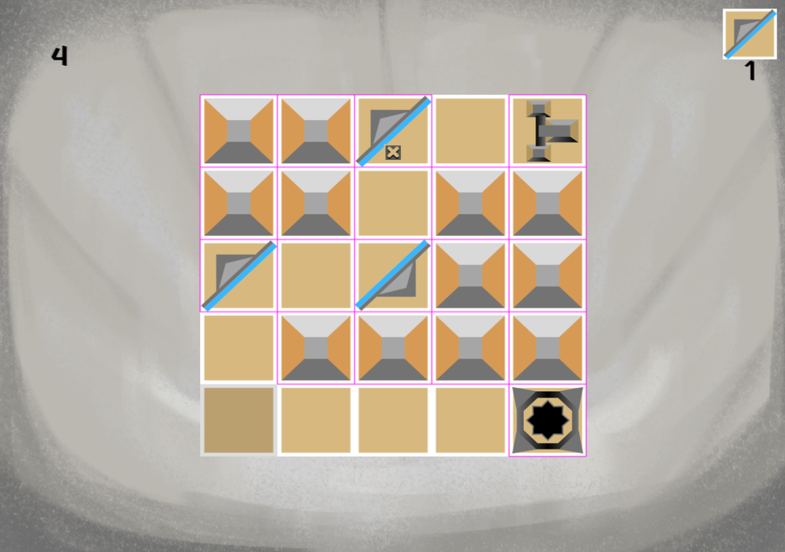

# **Introito Antiapotropaico,** 
## *o cómo contactar con los dioses para propósitos malignos por mandato de la faraona suprema*

Esto es un proyecto para la asignatura de Programación de Videojuegos en Lenguaje Intrepretados del Grado de Videojuegos de la Universidad Complutense de Madrid.

### Redes Sociales

Twitter (X): @Sopa de Escalofríos [https://x.com/SopaEscalofrios]

Email: sopadeescalofrios@gmail.com

### Descripción
En Introito Antiapotropaico, o cómo contactar con los dioses para propósitos malignos por mandato de la faraona suprema, el jugador encarna a un escriba esclavo de una faraona en el Antiguo Egipto. 
El jugador contactará con distintos dioses a través de rituales, para enviar unas cartas y poder complacer a su superiora y desbloquear distintos finales.

Podrá jugar a diferentes minijuegos para poder ser más afín a según qué dios, y así, conseguir el objetivo de la faraona: Convertirse en una diosa más.

### Web del juego
[Link a la web](nievesag.github.io/SopaDeEscalofrios/)

### UML del juego
[UML pdf](https://github.com/nievesag/SopaDeEscalofrios/blob/main/docs/Introito%20Antiapotropaico%20UML.pdf)

### Imágenes del juego

# Introito Antiapotropaico GDD 

**Introito Antiapotropaico, o cómo contactar con los dioses para propósitos malignos por mandato de la faraona suprema**

Autores: Carmen Gómez Becerra, Daniel Moreno Álvarez, Daniel Zhu, Denisa Juarranz Berindea, Nieves Alonso Gilsanz  
Grupo 6 - Sopa de escalofríos

---

### 1. Ficha técnica

**Título:** Introito Antiapotropaico, o cómo contactar con los dioses para propósitos malignos por mandato de la faraona suprema  
**Rating:** +13  
**Género:** Minijuegos  
**Plataforma:** Navegador web  
**Target:** Aficionados a los minijuegos tipo juegos flash y a la cultura egipcia  
**Modos de juego:** Un jugador  

### 2. Descripción

En Introito Antiapotropaico, o cómo contactar con los dioses para propósitos malignos por mandato de la faraona suprema, el jugador encarna a un escriba esclavo de una faraona en el Antiguo Egipto. El jugador contactará con distintos dioses a través de rituales para complacer a su superiora y desbloquear distintos finales.

### 3. Cartas usadas

| Persona           | Carta            | Detalles                                      |
|-------------------|------------------|-----------------------------------------------|
| Carmen Gómez      | Código: p12      | Nombre: Miedo - Tipo: Personaje / Emoción     |
| Daniel Moreno     | Código: m28      | Nombre: 7 Wonders - Tipo: Mecánica            |
| Daniel Zhu        | Código: p14      | Nombre: Ratón Comecables - Tipo: Personaje    |
| Denisa Juarranz   | Código: a12      | Nombre: Egipto - Tipo: Ambientación           |
| Nieves Alonso     | Código: m35      | Nombre: The Legend of Zelda: Majora’s Mask    |
| Grupo 5           | Código: p07      | Nombre: Ansiedad Tipo: Personaje / Emoción    |
| Slot Extra        | Código: p31      | Nombre: Insignias Tipo: Objeto Points: Pending|

## 4. Ciclo de juego

### 4.1. Partida genérica
El juego se basa en 5 ciclos, representados en días, en los que el jugador puede escribir hasta 3 cartas como máximo, una carta se puede enviar jugando uno de los 5 minijuegos a disposición del jugador, cada día se tendrán los mismos 5 minijuegos disponibles y el jugador tendrá la libertad de jugar los que quiera o de no jugar ninguno, pero lo importante es que un mismo juego no se puede repetir más de una vez el mismo día. Una vez pasados los cinco ciclos o días se revelará el final desbloqueado.

- **S0)** Pantalla de seleccionar minijuegos. El minijuego a jugar será a elección del jugador entre los cinco que hay, visualmente será un menú con orbes que servirán para acceder al juego deseado por medio de un clic. Al pasar de día se volverá a S1 de nuevo, el jugador elige cuándo acabar el día, incluso sin haber escrito las 3 cartas. Siempre tiene a disposición un botón de “pasar de día”, que significa que se pasa al siguiente ciclo.

- **S1)** Jugar un minijuego, hay cinco disponibles, cada uno representa a un dios y será la forma de contactarlos mediante cartas de recomendación por medio de rituales. Se podrán jugar hasta 3 de estos por día como máximo, pero no repetir un mismo minijuego por día. También se da la opción de volver al estado S1, pasando de ciclo sin haber jugado el máximo de 3 minijuegos que se han de jugar por ciclo.

- **S2)** Al pasar 5 días (ciclos) se desbloquea un final de los 6 disponibles (existe un final por cada dios y un final alternativo, que aparece si no has contactado con ningún dios o has alcanzado la victoria en minijuegos de dos o más dioses, haciendo que no se pongan de acuerdo) .

---

## 5. Minijuegos
Los minijuegos irán por etapas de dificultad según se vaya avanzando en el transcurso de los días. Las etapas son fácil (días 1 y 2), normal (días 3 y 4), difícil (día 5). Las diferencias entre dificultades variarán según el minijuego (se explica más abajo, en los detalles de cada minijuego). Al día se pueden hacer como máximo tres minijuegos, siempre y cuando no se repita un minijuego más de una vez, ya que nuestro escriba solo puede escribir tres cartas de recomendación al día antes de cansarse. Si el jugador decide no escribir todas las cartas o ninguna también podrá hacerlo afectando así al resultado final del juego. 

### 5.1. Minijuego 1: «Camino a la Duat»
La idea es llevar un corazón humano de un punto a otro en un recorrido con obstáculos, el jugador debe empujarlos en un determinado orden para poder despejar un camino hacia la salida y poder arrastrar el corazón sin bloquearse a sí mismo.

#### 5.1.1. Contexto
> "Socar te ama. A ti y a cada uno de los futuros muertos. Te ama a ti, con tus órganos frescos, y me ama a mí, con mis órganos podridos. Esa piel fina que te recubre te contiene y tras la muerte Socar te contendrá como una piel transitoria en tu viaje por la Duat.
Socar alimenta uno a uno cada corazón, cada estómago, cada intestino, cada mínima parte de aquel que llama a La puerta de caminos, inscribe tus peticiones y plegarias en los órganos de los finados de esta ciudad y hazlos llegar a lo más profundo del Mundo Subterráneo"

#### 5.1.2. Mecánicas

- **Movimiento:** Podrás moverte por el mapa con el WASD. El espacio de movimiento lo limitarán las cajas y paredes del puzle.
- **Empujar / Tirar:** Las mecánicas principales de este juego son simples. El jugador podrá empujar cajas y tirar de estas para poder abrirse hueco para llevar el corazón. Podrás empujar un objeto chocando contra él y podrás arrastrarlo manteniendo presionada la tecla de espacio y moviéndote hacia atrás.
- **Tiempo:** El jugador tendrá un tiempo límite para resolver el puzle. Dependiendo de la dificultad del nivel este cambiará.
- **Terrenos:**
  - **Terreno estándar:** Se comporta de manera normal.
  - **Hielo:** Los bloques empujados en este terreno se deslizarán hasta chocar o pasar a un terreno estándar.

#### 5.1.3. Coleccionables
- **Primer día:** Se obtendrá el logro «Amset», vasija con tapa en forma de cabeza humana, que guarda el hígado.
- **Segundo día:** Se obtendrá el logro «Hapy», vasija con tapa en forma de cabeza de babuino, que guarda los pulmones.
- **Tercer día:** Se obtendrá el logro «Kebeshenuef», vasija con tapa en forma de cabeza de halcón, que guarda los intestinos.
- **Cuarto día:** Se obtendrá el logro «Duamutef», vasija con tapa en forma de chacal, que guarda el estómago.
- **Quinto día:** Se obtendrá el logro «Henu», barca que posee Socar para cruzar la Duat.

#### 5.1.4. Dificultades
La dificultad de este minijuego se basa en los tiempos para resolver los puzles y en el mapa a resolver que cada vez tendrá más complejidad.

- **Fácil (primer y segundo día):** Tiempo: 90 segundos. Mapa: Primer mapa.
- **Normal (tercer y cuarto día):** Tiempo: 70 segundos. Mapa: Segundo mapa.
- **Difícil (quinto día):** Tiempo: 60 segundos. Mapa: Tercer mapa.

---

### 5.2. Minijuego 2: «La Vasija Entresija»
La idea de este minijuego es lanzar un vaso canopo con una fuerza y una dirección angular a elección del jugador, teniendo como objetivo llegar todo lo lejos posible e ir sumando puntuación a medida que la vasija va avanzando longitudinalmente: a mayor distancia mayor puntuación.

#### 5.2.1. Contexto
> "Nun, Las Aguas de la Vida, está encolerizado: una fuerte tempestad llena el paisaje. Una fuerte lluvia que se siente como pedradas, fortísimos relámpagos que son capaces de acobardar al más valeroso, vorágines que tragan todo a su paso, incluso las formas de vida de esta zona caudalosa parecieran haber enloquecido.
Contacta con Anuket, diosa del agua enviándole una carta y órganos de gente sacrificada metidos en un vaso canopo para que ayude en la causa de apaciguar las aguas y traer de vuelta a la normalidad al río Nilo"

#### 5.2.2. Mecánicas

- **Lanzamiento:** el jugador tendrá la capacidad de lanzar el vaso canopo con una dirección y fuerza determinadas.
  - La dirección se establece según la posición a la que apunte el ratón.
  - La fuerza de disparo se mide manteniendo el clic, haciendo aparecer una barra que sube y baja. Se debe soltar en el momento justo para conseguir una mayor o menor fuerza.
- **Obstáculos que favorecen al jugador:**
  - **Cocodrilo:** cuando la vasija entra en contacto con el cocodrilo, esta rebota e impulsa a la vasija a una mayor velocidad permitiendo que se llegue más lejos.
  - **Agua:**  el mismo agua del río hace rebotar a la vasija. No es como tal un obstáculo, pero sigue siendo un elemento que permite avanzar por medio del rebote.
- **Obstáculos que entorpecen al jugador:**
  - **Vorágine:** al entrar en contacto con una vorágine, esta se tragará la vasija, terminando su partida en el minijuego y parando su puntuación.
  - **Hipopótamo:**  el hipopótamo impulsará a la vasija con menor velocidad de la que traía de base.
- **Medidor de distancia:** en la parte superior de la pantalla habrá un medidor de distancia en metros, que irá contando conforme vaya avanzando longitudinalmente el vaso.
- **Medidor de fuerza:** en la parte superior izquierda de la pantalla habrá un medidor de la fuerza con la que se ha lanzado la vasija, indicando si ha habido más o menos de dicha fuerza.

#### 5.2.3. Coleccionables
- **Primer día:** Se obtendrá el logro «Pluma de la corona», que será una pluma de la corona de plumas de Anuket.
- **Segundo día:** Se obtendrá el logro «Concha cauri».
- **Tercer día:** Se obtendrá el logro «Frasco Asuán», que será un frasco de alabastro lleno de agua de las cataratas de Asuán del río Nilo.
- **Cuarto día:** Se obtendrá el logro «Cetro de Papiro».
- **Quinto día:** Se obtendrá el logro «Cefalea bóvida», que será la cabeza decapitada de una gacela dorcas, como muestra máxima de gratitud por parte de la diosa Anuket cuyo símbolo consagrado es este. 

#### 5.2.4. Dificultades
- **Fácil (primer y segundo día):** La partida se compondrá de obstáculos: agua, cocodrilo.
- **Normal (tercer y cuarto día):** La partida incluirá el hipopótamo, contando además con los obstáculos de anteriores días.
- **Difícil (quinto día):** La partida incluirá la vorágine, contando además con los obstáculos de anteriores días.

#### 5.2.4. Victoria y derrota
- **Derrota**: el juego se podrá perder de dos formas, si la vasija llega al punto de pararse o si se la traga un obstáculo vorágine que aparece en la dificultad difícil del quinto día. Si se pierde se volverá al menú selector de minijuegos y no se obtendrán logros. 
- **Victoria**: la forma de ganar el juego dependerá de la dificultad en la que se juegue. Si se gana se volverá al menú selector de minijuegos y no se obtendrá el logro correspondiente.
  - Para ganar en la dificultad **fácil (primer y segundo día)** se tendrá que superar la distancia de **5000 codos**.
  - Para ganar en la dificultad **normal (tercer y cuarto día)** se tendrá que superar la distancia de **2700 codos**.
  - Para ganar en la dificultad **difícil (quinto día)** se tendrá que superar la distancia de **2500 codos**.

### 5.3. Minijuego 3: «Al rescate de los escarabajos»
La idea es rescatar a unos escarabajos que han sido pegados con miel de su dulce cárcel. A mayor número de escarabajos rescatados, mayor puntuación. Es un bubble shot.

#### 5.3.1. Contexto
> "Jepri, el dios del sol autocreado, sufre de una fuerte tristeza: sus adorados ahijados, los escarabajos de todo Egipto, han sido capturados. Para contentarle de nuevo, y evitar su ira, deberás rescatar al mayor número de escarabajos posibles, en el menor tiempo posible."

#### 5.3.2. Dificultades
- **Día 1 :** Empezaremos con 3 filas iniciales completas y un objetivo de 3000 puntos
- **Día 2 :** Empezaremos con 4 filas iniciales completas y un objetivo de 4000 puntos
- **Día 3 :** Empezaremos con 5 filas iniciales completas y un objetivo de 5000 puntos
- **Día 4 :** Empezaremos con 6 filas iniciales completas y un objetivo de 5500 puntos
- **Día 5 :** Empezaremos con 7 filas iniciales completas y un objetivo de 6000 puntos

#### 5.3.3. Mecánicas
- **Lanzamiento:** Con el ratón, apuntaremos hacia el lugar al que queremos disparar y click izquierdo para disparar. Podrá rebotar con las paredes. 

- **Caída:** Cuando haya 3 o más vecinos del mismo color que el lanzado, los eliminará, otorgando al jugador 100 puntos por escarabajo liberado. Como consecuencia, también liberará los que hayan podido quedar sueltos, ororgando 50 puntos adicionales por escaarabajo

#### 5.3.4. Coleccionables
- **Primer día:** Tras completar el juego el primer día recibirá un escarabajo negro.
- **Segundo día:** Tras completar el juego el primer día recibirá un escarabajo verde.
- **Tercer día:** Tras completar el juego el primer día recibirá un escarabajo azul.
- **Cuarto día:** Tras completar el juego el primer día recibirá un escarabajo rojo.
- **Quinto día:** Tras completar el juego el primer día recibirá un escarabajo dorado.

---

### 5.4. Minijuego 4: «Tiro al arco mágico»
La idea es hacer un juego tipo Angry Birds, en donde el jugador puede utilizar diferentes tipos de flechas con diferentes efectos, para cazar animales (leones, ratas).

#### 5.4.1. Contexto
> "Inheret, “aquel que ha traído la diosa lejana  y aquel que simboliza el poder creativo del sol”, te ha encargado dar exterminio a aquellos animales indignos de vivir en su desierto.
Se te será otorgado su arco mágico para cumplir con tu deber o serás castigado con cien años perdido en las arenas infinitas de su desierto."

#### 5.4.2. Dificultades
- **Fácil (Días 1 y 2):**
Flecha normal: 5
Flecha explosiva: 2
Flecha expansiva: 2
Flecha triple: 3 

- **Intermedio (Días 3 y 4):**
Flecha normal: 5
Flecha explosiva: 1
Flecha expansiva: 1
Flecha triple: 2 

- **Difícil (Día 5):**
Flecha normal: 10
Flecha explosiva: 1
Flecha triple: 1

#### 5.4.3. Mecánicas
- **Lanzamiento:** Con el ratón, arrastraremos hacia atrás desde el jugador para cargar la fecha. Deslizamos el ratón hacia arriba o abajo para cambiar la trayectoria de la flecha. Al soltar el click izquierdo del ratón se lanzará la flecha.
Para activar el efecto especial de cada flecha mágica hay que pulsar la tecla E cuando está en el aire.

- **Tipos de flechas:**
  - **Flecha triple:** Se multiplica en 3 flechas.
  - **Flecha expansiva:** Su efecto es convertirse en una bola gigante que rebota por el mapa.
  - **Flecha explosiva:** Causa una explosión en área, afecta solo a obstáculos.

#### 5.4.4. Coleccionables
- **Primer día:** «Flecha», punta de flecha destrozada.
- **Segundo día:** «Lanza», punta de lanza destrozada.
- **Tercer día:** «Flecha mágica», punta de flecha mágica.
- **Cuarto día:** «Lanza mágica», punta de lanza mágica.
- **Quinto día:** «Pluma», pluma dorada.

---

### 5.5. Minijuego 5: «El sendero del Sol»
Un minijuego de tipo puzle en el objetivo es guiar un rayo de sol a través de distintos niveles utilizando espejos. Los jugadores deberán mover y rotar los espejos estratégicamente para hacer que el rayo de luz rebote en la dirección correcta y resolviendo rompecabezas visuales.

#### 5.5.1. Contexto
> "Shu, divinidad danzante del aire, él desea iluminar todo a su paso,  él es la sequedad, él es el tenue brillo de atardecer… Ayuda a Shu a apartar la tenebrosa oscuridad de las profundidades de la pirámide para completar su destino. Coloca y mueve los espejos para guiar a Shu, y él te dará su bendición."

#### 5.5.2. Dificultades
Para cada uno de los cinco días habrá un tablero diferente que tendrá más o menos espejos.

#### 5.5.3. Mecánicas
- **Espejos:** El jugador podrá poner espejos en cualquier casilla vacía del tablero y también podrá girarlo 90 grados cada vez que de a su botón de girar. También podrá eliminarlos si da a su botón de eliminar.
- **Activar la luz:** Para comprobar que todos los espejos están correctamente posicionados el jugador tendrá que presionar sobre la compuerta disparadora para que el rayo comience su recorrido. Si este consigue llegar a la zona requerida el juego termina y consigues el respectivo logro.

#### 5.5.4. Coleccionables
- **Primer día:** «Pequeña estrella», estrella de cuatro puntas.
- **Segundo día:** «Estrella», estrella de seis puntas.
- **Tercer día:** «Gran estrella», estrella de ocho puntas.
- **Cuarto día:** «Sol», sol.
- **Quinto día:** «Sol radiante», sol radiante.

## 6. UI

### 6.1. Menús

#### 6.1.1. Pantalla de iniciar partida

#### 6.1.2. Menú seleccionador de minijuego

#### 6.1.3. Final

## 7. Estética

### 7.1. Visual

#### 7.1.1. Paleta
Para infundir miedo por medio de la estética, hemos optado por unos colores poco saturados y apagados, para otorgarle un estilo oscuro, sombrío, decrépito, melancólico y deprimente.

#### 7.1.2. Tanqia, el heraldo del caos y faraona de la luna
Se muestran aquí imágenes de la faraona Tanqia representada en el juego:

### 7.2. Sonora

#### 7.2.3. Minijuegos

#### 7.2.4. Otros
Referencias a sonidos de inspiración egipcia y canciones que pueden utilizarse en contextos especiales. Enlaces de ejemplo:
- [Ejemplo de canción 1](https://youtu.be/8cDThq1fIJc?si=Cvg07-fCg0QbTh9z)
- [Ejemplo de canción 2](https://youtu.be/aYQ_RxxWgfg?si=hjDnPgqMP0WSt5GS)

---

## 8. Contenido

### 8.1. Narrativa
El jugador podrá obtener 1 final de 6 disponibles, estos son: uno por cada dios y otro por empate entre dioses (has jugado a los minijuegos de dos o más deidades el mismo número de veces) o por no jugar a ningún minijuego.
La historia se mostrará mediante una serie de escenas de imágenes y texto.

### 8.2. Personajes

#### 8.2.1. El Escriba
El protagonista, el jugador que realiza las misiones para la faraona.

#### 8.2.2. Faraona (Tanqia, El heraldo del caos)
Personaje poderoso y autoritario que da órdenes al escriba.
No hay ka tan puro como el mío. No hay cuerpo, no hay sangre, ni carne más limpia que la mía. La luz ha venido a mí, y yo la esparciré por cada confín del mundo de vuelta, inundando todo de mi eterno abrazo que otorgará paz a cada cuerpo sin gracia. Prevaleceré. Pasarán por mis entrañas infinitas reencarnaciones. Prevaleceré
**Descripción sobre el "ka":** En la mitología egipcia, el "ka" era considerado la fuerza vital de cada individuo, otorgada en el momento de la concepción. Se creía que podía conferir inmortalidad y, en algunos casos, permitir que los humanos se transformaran en dioses.
#### 8.2.3. Deidades
- **Socar** Persuade a Aquel que está sobre su arena, y no habrá difunto desamparado. Los cuerpos permanecerán a salvo hasta la infinitud de mi existencia.
- **Nun** Convence a La regente de Nubia, y tendré el favor de las aguas, fuente de la que todo nace y emerge, existencia misma, germen de todo.
- **Jepri** Seduce a El que es transformado, y no habrá eclipse que ennegrezca mi optimismo, el sendero de mi apoteosis se trazará cada día más claro.
- **Inheret** Fascina a Quien trae a la lejana, y jamás necesitaré escudo, pues cualquier conflagración que emerja no será rival para mi férreo poder de dominación. 
- **Shu** Atrae a La Luz y toda mi sangre acabará por envenenarse de ese preciado fulgor que se deja tras las tinieblas de aquellos ojos que decoran el firmamento. 

#### 8.3. Coleccionables
Cada vez que se completa un minijuego correctamente se podrá conseguir un logro. Cada juego tendrá 5 logros en total, uno por cada día, y, dado que según el ciclo de juego solo se pueden jugar 3 juegos diferentes cada día, al final del juego se podrán haber conseguido 15 logros en total.

---

## 9. Referencias

### 9.1. Mecánicas

#### 9.1.1. Juegos
Inspiraciones para las mecánicas del juego:
- *Toss the Turtle* - GonzoSSM (2016)
- *Angry Birds* - Rovio Entertainment (2009)
- *LIT: Bend the Light* - Copperglass (2020)
- *Bubble Shooter*

### 9.2. Artísticas

#### 9.2.1. Juegos
Inspiración visual tomada de:
- *Potioncraft: Alchemist Simulator* - niceplay games (2021)
- *Inkulinati* - Yaza Games (2022)
- *The Legend of Zelda: A Link Between Worlds* - Nintendo (2013)
- *Paper Mario* - Nintendo (2000)
- *Club Penguin (Doodle dimension)* - Disney Interactive Studios (2005)
- *Cuphead* - Studio MDHR (2017)

#### 9.2.2. Otros
Inspiración artística adicional de:
- Murales del Antiguo Egipto
- La figura icónica de *Lola Flores* como "La Faraona"
- *Rocío Jurado*, "La Más Grande"

- [Lovecraft y Egipto](https://lovecraft.fandom.com/wiki/Nephren-Ka)
- [Hermandad del Faraón Negro](https://hplovecraft.fandom.com/es/wiki/Hermandad_del_Fara%C3%B3n_Negro)
- [Ka en la mitología egipcia](https://es.wikipedia.org/wiki/Ka_(mitolog%C3%ADa))

#### Assets
- Sprites minijuegos: Carmen Gómez
- Fondos: Nieves Alonso
- Ilustraciones inicio y final: Nieves Alonso
- Concept art: Carmen Gómez

